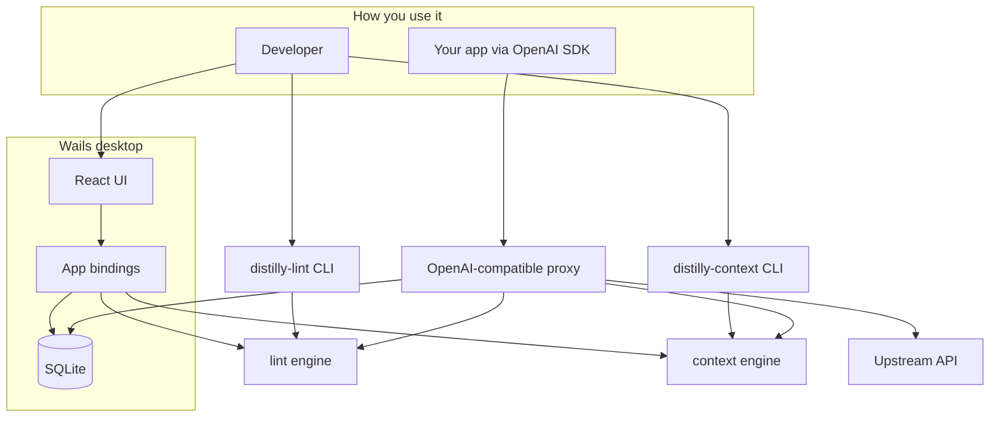
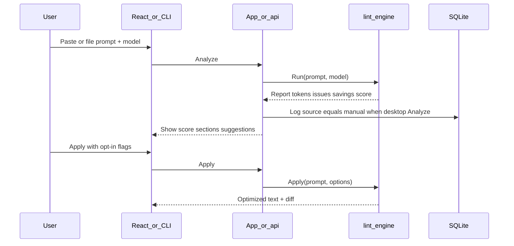
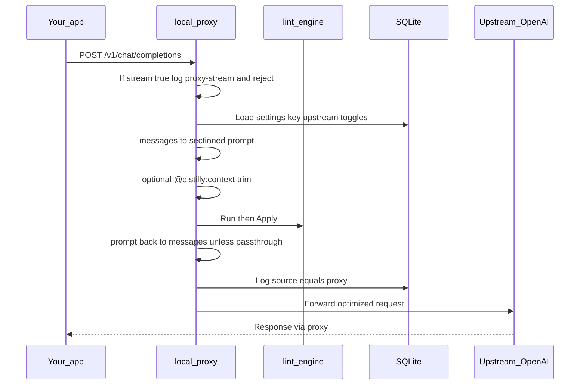
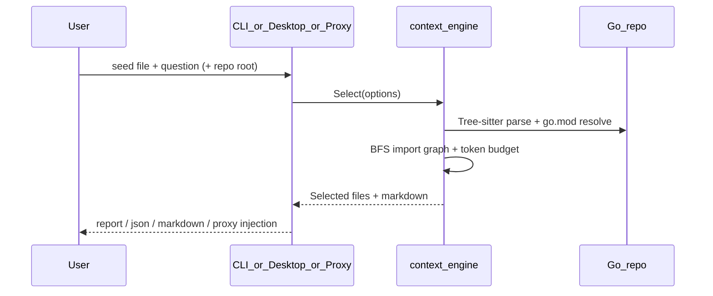

# Distilly architecture overview

**Distilly** is a local-first “ESLint for prompts”: it analyzes LLM prompts, finds waste (duplicates, bloated history, verbose structured text), estimates token/cost impact, and can deterministically rewrite prompts without changing meaning. No AI rewrite backend in v1 — the engine is rule-based Go code.

You interact with it in three primary ways (plus an optional agent on-ramp):

1. **Desktop app** (Wails: Go + React) — paste a prompt, analyze, apply fixes, see dashboard/settings
2. **CLI** (`distilly-lint`) — lint a prompt file from the terminal
3. **Local proxy** (OpenAI-compatible) — point your app at `localhost:8787`; Distilly optimizes chat requests before forwarding upstream

For coding agents, a **project rule or skill** should call those surfaces (CLI/proxy), not reimplement Distilly’s heuristics. See [user-guide.md](user-guide.md#5-wire-distilly-into-an-ai-agent-rule-or-skill).

## Core idea

Prompts are split into **sections** (`System` / `Examples` / `History` / `Question`), checked for waste, optionally rewritten, and scored — whether you pasted text in the UI or sent chat `messages` through the proxy.

## Package map

| Area | Path | Role |
|------|------|------|
| Desktop entry | [`src/main.go`](../src/main.go), [`src/app.go`](../src/app.go) | Wails lifecycle; binds UI → Go |
| CLI | [`src/cmd/lint`](../src/cmd/lint), [`src/cmd/context`](../src/cmd/context) | Headless lint + code context |
| Lint engine | [`src/internal/lint`](../src/internal/lint) | `Run` (report) + `Apply` (optimize) |
| Context engine | [`src/internal/context`](../src/internal/context) | `Select` + `FormatContext` (Tree-sitter import graph) |
| UI DTOs | [`src/internal/api`](../src/internal/api) | JSON shapes for Analyze/Apply/SelectContext |
| Proxy | [`src/internal/proxy`](../src/internal/proxy) | `/v1/chat/completions` gateway + `@distilly:context` |
| Persistence | [`src/internal/store`](../src/internal/store) | Settings + request metrics |
| Helpers | `tokenizer`, `dedupe`, `history`, `cost`, `diff` | Count, find dups, flag history, $, diffs |
| Frontend | [`src/frontend`](../src/frontend) | Lint / Context / Dashboard / Settings |

## Flow 1 — Manual lint (UI or CLI)

**In plain terms:** You give Distilly a prompt. It counts tokens, finds duplicates and other waste, estimates dollars saved, and (if you approve) rewrites the prompt. Exact duplicates apply automatically; near-duplicates and JSON conversion need an explicit opt-in.

## Flow 2 — Proxied chat completion

**In plain terms:** Your code talks to Distilly as if it were OpenAI. Distilly turns chat messages into a sectioned prompt, cleans it up, turns it back into messages, logs savings, and forwards the slimmed request to the real API. Streaming is rejected today (those calls are still logged as `proxy-stream` with no savings). Native Anthropic Messages API is out of scope for M4 — Claude works only via OpenAI-compatible gateways.

Start and stop the proxy from **Settings** (`StartProxy` / `StopProxy` / `GetProxyStatus` on [`src/app.go`](../src/app.go)).

## Desktop UI surface

- **Lint workspace** — editor, model picker, score, sections, suggestions, apply + diff
- **Context workspace** — repo root, seed file, question; selected files table + markdown copy
- **Dashboard** — aggregate tokens/$ saved, recent requests (from Lint Analyze and proxy logs)
- **Settings** — upstream URL, API key, proxy port, start/stop/status, approval toggles, passthrough, code-context defaults

Data lives in SQLite under the user config dir (`…/distilly/distilly.db`).

## User documentation

End-user explanation of every shipped surface (Lint, Dashboard, Settings, CLI, proxy) is in [`user-guide.md`](user-guide.md).

## Test fixtures

Prompt fixtures used for CLI/desktop regression and exploratory coverage are catalogued in [`prompt-fixtures.md`](prompt-fixtures.md) (`src/testdata/prompts/`).

Code-context repo fixtures are catalogued in [`code-context-fixtures.md`](code-context-fixtures.md) (`src/testdata/repos/`).

## Flow 3 — Code context selection

**In plain terms:** Given a seed `.go` file and a question, Distilly walks the import graph (same-package siblings, direct imports, one-hop reverse importers, depth-limited transitive imports) and returns only the files that matter — formatted as markdown code blocks. The proxy can replace an `@distilly:context` marker in the system message with this output before lint optimization runs.

## Milestone context

See also [`roadmap.md`](roadmap.md).

- **M1–M3:** CLI lint, regression harness, confidence-tier apply — done
- **M4:** Desktop app + SQLite + proxy lifecycle — done
- **M5:** Code-context optimizer (Tree-sitter, CLI, desktop workspace, proxy marker) — done
