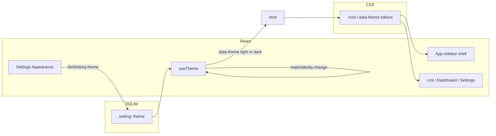

# Native macOS Desktop Theme — Design

**Date:** 2026-08-13  
**Branch:** `feature/native-macos-theme`  
**Status:** Implemented

## Goal

Make the Distilly Wails desktop app read as a native macOS utility: light theme by default, Light / Dark / System preference, left sidebar navigation, and Settings as macOS-style grouped lists — without rewriting Lint/Dashboard behavior or adding a component library.

## Decisions (locked)

| Topic | Choice |
|-------|--------|
| Layout | Sidebar shell (Lint / Dashboard / Settings); drop top “Distilly / Desktop” header |
| Depth | Chrome + shared controls; Settings remade as grouped lists; Lint/Dashboard lighter restyle only |
| Accent | Wood brown from logo barrel (`#8B5E3C` light; slightly lighter in dark, e.g. `#C4A484`) |
| Branding | Sidebar uses Distilly wordmark and/or barrel logo ([`docs/distilly-logo.png`](docs/distilly-logo.png)); chrome stays macOS gray/white, not wood-washed |
| Theme approach | Semantic CSS tokens + `data-theme` on `<html>` |
| Default preference | Light |
| Preference values | `light` \| `dark` \| `system` |
| Persistence | SQLite setting key `theme` |
| Native chrome | Keep default Wails titlebar; no hidden titlebar, vibrancy, or traffic-light inset |

## Out of scope

- Frameless / hidden titlebar / vibrancy / sidebar traffic lights
- New UI component library (shadcn, etc.)
- Rewriting Lint or Dashboard information architecture
- Changing proxy, analysis, or settings field semantics (except adding `theme`)
- Windows/Linux-specific theming APIs (Wails `WindowSet*Theme` is Windows-only; ignore)

## Architecture

### Theme resolution

1. Load preference from SQLite (`theme`), default `light` if unset/invalid.
2. Resolve effective theme:
   - `light` → `data-theme="light"`
   - `dark` → `data-theme="dark"`
   - `system` → follow `prefers-color-scheme`, update on `change` events
3. Appearance control in Settings writes preference immediately via `SetSetting` (not behind Save).
4. Sync Wails `BackgroundColour` (or equivalent runtime call if available) when effective theme changes so the webview edge matches the canvas.

### Token layer

Define semantic CSS custom properties in [`src/frontend/src/style.css`](src/frontend/src/style.css) under `:root` (light) and `[data-theme="dark"]` (dark). Examples:

| Token | Role |
|-------|------|
| `--bg-window` | Main content canvas |
| `--bg-sidebar` | Sidebar fill |
| `--bg-surface` | Inset groups / cards |
| `--bg-fill` | Inputs, secondary buttons |
| `--border` | Hairlines |
| `--text-primary` | Titles, primary copy |
| `--text-secondary` | Labels, muted |
| `--accent` | Primary actions, selection, focus (wood brown) |
| `--accent-fg` | Text on accent (near-white) |
| `--danger` / `--success` / `--warning` | Errors, savings, mid scores |

Accent values (locked starting point; tweak only if contrast fails WCAG-ish checks on buttons):

| Theme | `--accent` | Notes |
|-------|------------|-------|
| Light | `#8B5E3C` | Mid barrel stave |
| Dark | `#C4A484` | Lighter wood so selected nav / buttons read on dark fills |

Tailwind utilities should consume these tokens (e.g. `bg-[var(--bg-surface)]`, or Tailwind v4 `@theme` mapping). Remove the current navy radial gradients and hardcoded `sky-*` / `white/10` / `black/25` palette from UI surfaces.

Score and diff colors stay semantic success/warning/danger (not wood accent). Do not tint the whole window brown — surfaces stay neutral macOS gray/white (and dark equivalents).

### Typography

- UI: `-apple-system, BlinkMacSystemFont, "SF Pro Text", "Segoe UI", sans-serif`
- Mono: `ui-monospace, "SF Mono", Menlo, monospace`
- Drop unused `"IBM Plex Sans"` declaration
- Avoid uppercase tracked “eyebrow” labels in chrome and Settings; Lint/Dashboard may keep short section titles in sentence case

## UI design

### App shell

[`src/frontend/src/App.tsx`](src/frontend/src/App.tsx):

- Horizontal split: fixed-width sidebar (~220px) + scrollable main
- Sidebar: barrel logo (small) + Distilly wordmark (quiet, not a second hero headline), then nav rows for Lint / Dashboard / Settings
- Selected nav: wood-accent-tinted background + accent text
- Unselected: primary/secondary text, hover fill
- Main: page content with comfortable padding; no duplicate top brand header
- Copy logo asset into the frontend (e.g. `src/frontend/src/assets/distilly-logo.png`) so the bundled app can load it

### Settings

[`src/frontend/src/pages/Settings.tsx`](src/frontend/src/pages/Settings.tsx):

1. **Appearance** (new, top) — segmented control Light | Dark | System; immediate persist
2. **Upstream** — same fields; grouped list styling
3. **Local proxy** — same fields/actions; grouped list styling
4. **Optimization defaults** — same toggles; grouped list styling
5. **Save** — still required for non-theme settings

Grouped list pattern: section caption above a rounded `--bg-surface` block; rows separated by hairline borders; label left, control right when space allows; helper text as secondary caption under the group or row.

### Lint & Dashboard

Keep existing layouts and hooks. Restyle only:

- Surfaces → token backgrounds/borders
- Primary buttons → accent
- Secondary buttons → bordered fill
- Page titles → primary text; subtitles → secondary
- Error banners → danger tokens
- Stat cards / score / diff → tokenized surfaces; keep green/amber/red meaning

Files: [`LintWorkspace.tsx`](src/frontend/src/pages/LintWorkspace.tsx), [`Dashboard.tsx`](src/frontend/src/pages/Dashboard.tsx), and shared components under [`src/frontend/src/components/`](src/frontend/src/components/).

### Shared helpers (optional, only if they reduce duplication)

- `SidebarNav` — nav list
- `GroupedList` / `GroupedRow` — Settings inset groups
- `SegmentedControl` — theme preference

No broader design-system package.

## Data & API

### Setting key

Add to frontend [`SettingKey`](src/frontend/src/lib/settings.ts) and defaults:

- Key: `theme`
- Default: `light`
- Valid: `light`, `dark`, `system`

Backend store already accepts arbitrary string settings via `GetSetting` / `SetSetting`; no schema migration required. Proxy code does not need to read `theme`.

### Theme hook

New `useTheme` (or equivalent):

- Loads preference on mount
- Exposes `{ preference, resolved, setPreference }`
- Sets `document.documentElement.dataset.theme` to resolved `light` | `dark`
- Subscribes to `prefers-color-scheme` when preference is `system`
- Calls `setPreference` → `SetSetting('theme', value)` and updates DOM immediately

Mount theme provider near app root so all pages inherit.

## Wails window background

Update [`src/main.go`](src/main.go) `BackgroundColour` to a light default matching `--bg-window` (approx `#F5F5F7`). If runtime allows updating background from the frontend when theme resolves, do so; otherwise light default is acceptable for MVP (dark users may see a brief light edge until content paints).

## Testing

- Unit/logic: theme resolution helper (`light`/`dark`/`system` + mock media query) if extracted as a pure function
- Manual: switch Light/Dark/System; change OS appearance while on System; Settings Save still persists non-theme fields; Lint analyze/apply and Dashboard refresh unchanged
- Visual smoke: sidebar selection, grouped Settings, primary/secondary buttons, score/diff colors in both themes

## Success criteria

1. Fresh install opens in light theme and looks like a light macOS utility (sidebar + gray canvas + white groups).
2. User can choose Light, Dark, or System; choice survives restart.
3. System tracks OS appearance without restart.
4. Accent is wood brown from the logo; barrel + wordmark sit quietly in the sidebar; surfaces stay neutral macOS gray/white.
5. Lint and Dashboard behavior unchanged; only look-and-feel updated.
6. No frameless/vibrancy work shipped in this pass.
