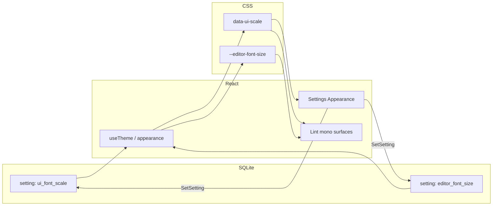

# Font Size Settings — Design

**Date:** 2026-08-14  
**Branch:** `feat/font-size-settings`  
**Status:** Implemented

## Goal

Add Appearance controls so users can enlarge general interface text in steps, and independently set an explicit pixel size for Lint input/output monospace areas — without rem-root zoom that blows up spacing.

## Decisions (locked)

| Topic | Choice |
|-------|--------|
| Interface control | Stepped: Default / Large / Extra large |
| Editor control | Explicit px: 12 / 14 / 16 / 18 |
| Mechanism | CSS variables + `data-ui-scale` on `<html>` (same Appearance persistence pattern as theme / high contrast) |
| UI scale key | `ui_font_scale`: `default` \| `large` \| `xlarge` |
| Editor size key | `editor_font_size`: `12` \| `14` \| `16` \| `18` |
| Defaults | `ui_font_scale=default`; `editor_font_size=14` |
| Persistence | Immediate `SetSetting` (not behind Settings form Save) |
| Editor scope | Lint only: prompt textarea, before/after panels, DiffView, and any other Lint monospace blocks |
| Non-editor mono | Settings API key / base URL stay on UI scale, not editor size |
| OS text size | Out of scope — no auto-follow |

## Out of scope

- Continuous slider for UI or editor size
- Changing `html` rem root solely to scale UI (spacing blow-up)
- Applying editor size outside Lint
- Redesigning page IA
- High-contrast / theme behavior changes

## Architecture



### Resolution

1. On startup, load `ui_font_scale` and `editor_font_size` (invalid/missing → defaults).
2. Set `document.documentElement.dataset.uiScale` to `default` | `large` | `xlarge`.
3. Set `document.documentElement.style` (or a CSS variable on `:root` via attribute) `--editor-font-size` to `12px` | `14px` | `16px` | `18px`.
4. Settings Appearance writes each preference immediately via `SetSetting`.
5. UI scale and editor size are independent: changing one does not alter the other.

### Settings UI

Appearance section (after High contrast):

- **Interface text** — segmented control: Default | Large | Extra large  
- **Editor text** — segmented control or compact select: 12 | 14 | 16 | 18 (label as px)

Descriptions (short):

- Interface: “Enlarge labels, buttons, and chrome across the app.”
- Editor: “Font size for Lint prompt, diffs, and other monospace panels.”

## CSS mapping

### Interface scale

Prefer remapping Tailwind text tokens under `[data-ui-scale="…"]` (Tailwind v4 `--text-*` theme vars), not root `font-size` zoom.

Approximate targets (implementation may tune slightly after visual check):

| Token role | default | large (~+12–15%) | xlarge (~+25–30%) |
|------------|---------|------------------|-------------------|
| `text-xs` | current | ~one step up | ~two steps up |
| `text-sm` | current | ~one step up | ~two steps up |
| `text-base` / `text-lg` / display | current | proportional bump | proportional bump |

`default` adds no overrides (current look).

Sidebar, Settings, Dashboard, and Lint **chrome** (titles, buttons, non-mono labels) follow UI scale.

### Editor size (Lint monospace)

Shared utility class, e.g. `font-editor`:

```css
.font-editor {
  font-family: var(--font-mono);
  font-size: var(--editor-font-size);
}
```

Apply to:

- Lint prompt `<textarea>`
- Optimize before/after `<pre>` bodies
- `DiffView` code lines
- Any other Lint monospace content blocks

Do **not** apply to Settings monospace fields.

Default `--editor-font-size: 14px` when preference is unset.

## Files (expected)

| Area | Files |
|------|--------|
| Parse helpers + tests | `src/frontend/src/lib/theme.ts`, `theme.test.ts` (or small `appearance.ts` if cleaner — prefer extending `theme.ts` to match contrast) |
| Setting keys | `src/frontend/src/lib/settings.ts` |
| Apply on `<html>` | `src/frontend/src/hooks/useTheme.tsx` |
| Tokens / utility | `src/frontend/src/style.css` |
| Controls | `src/frontend/src/pages/Settings.tsx` |
| Lint mono wiring | `src/frontend/src/pages/LintWorkspace.tsx`, `src/frontend/src/components/DiffView.tsx` |

## Verification

- Unit tests: parse `ui_font_scale` / `editor_font_size`; invalid → defaults
- Manual: change Interface text Default → Large → Extra large; confirm chrome grows, Lint mono unchanged
- Manual: change Editor text 12 → 18; confirm prompt / before-after / DiffView change; Settings API key does not
- Restart app: both preferences persist
- Smoke with High contrast on/off — both features compose

## Non-goals reminder

No OS text-size auto, no rem-root zoom, no editor size outside Lint, no continuous sliders.
