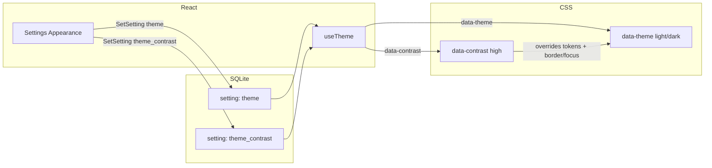

# High Contrast Theme Toggle — Design

**Date:** 2026-08-14  
**Branch:** `feat/high-contrast-theme`  
**Status:** Approved for implementation planning

## Goal

Add an explicit **High contrast** Appearance option so users with low vision get stronger text, borders, and focus chrome — without replacing Light / Dark / System, and without changing layout or type size.

## Decisions (locked)

| Topic | Choice |
|-------|--------|
| UX shape | Separate toggle; Light / Dark / System unchanged |
| Strength | Color + chrome (not type/padding “accessibility kit”) |
| Mechanism | `data-contrast` attribute overlay on existing `data-theme` |
| Preference values | `themeContrast`: `normal` \| `high` |
| Default | `normal` |
| Persistence | SQLite setting key `theme_contrast` (immediate `SetSetting`, like theme) |
| OS auto | Out of scope — do not auto-follow `prefers-contrast` |

## Out of scope

- Larger base font or control padding
- Fourth theme mode that replaces Light/Dark/System
- Auto-enabling from OS `prefers-contrast`
- Redesigning Lint / Dashboard / Settings information architecture
- New component library

## Architecture

### Resolution

1. Load `theme` and `theme_contrast` from SQLite on startup.
2. Resolve light/dark as today → `document.documentElement.dataset.theme`.
3. If contrast is `high`, set `dataset.contrast = "high"`; otherwise remove the attribute or set `"normal"`.
4. Invalid / missing contrast → `normal`.
5. Changing Light/Dark/System while High contrast is on keeps contrast; only the base palette changes.
6. Window background colour continues to follow resolved light/dark only (no separate HC window colour unless token `--bg-window` is later overridden; initial HC overrides focus on fg, muted, border, soft fills, and chrome — keep window canvases stable unless contrast ratio on soft surfaces requires a nudge).

### Settings UI

Appearance section gains a second row:

- **Theme** — existing Light / Dark / System segmented control
- **High contrast** — toggle (or two-option control: Off / On) that calls `setContrast('high' | 'normal')` immediately

Not gated by the Settings form Save button.

## Token & chrome overrides

Under `[data-contrast="high"]` (and `[data-theme="dark"][data-contrast="high"]` where dark-specific):

| Token / chrome | Intent |
|----------------|--------|
| `--fg` | Near black (light) / near white (dark) |
| `--muted` | Darker (light) / lighter (dark); target readable secondary text (~4.5:1+ on window bg) |
| `--border` | Stronger, less transparent hairlines |
| Soft fills (`*-soft`) | Slightly stronger tints so chips/alerts stay readable |
| `--accent` | Keep wood brown; nudge only if button contrast fails |
| Border width | ~2px via CSS variable / global rule under high contrast |
| Focus | Stronger ring (e.g. ring-2 equivalent) and clearer accent border on focused fields |

Prefer CSS under `[data-contrast="high"]` so individual pages need few or no class rewrites. Shared field/button class strings may gain a small focus-ring bump if global CSS cannot override Tailwind utilities cleanly — keep that minimal.

Layout, spacing, and type scale stay unchanged.

## Files (expected)

| Area | Files |
|------|--------|
| Tokens / chrome | `src/frontend/src/style.css` |
| Contrast helpers | `src/frontend/src/lib/theme.ts`, `theme.test.ts` |
| Setting key | `src/frontend/src/lib/settings.ts` |
| Provider | `src/frontend/src/hooks/useTheme.tsx` |
| UI | `src/frontend/src/pages/Settings.tsx` |

## Verification

- Unit tests: parse contrast preference; invalid → `normal`; helpers used by the provider
- Manual: enable High contrast in light and dark; confirm stronger text, borders, focus rings; disable and confirm restore; restart app and confirm persistence
- Smoke: Light / Dark / System still work with contrast off and on

## Non-goals reminder

No OS auto-contrast, no font/padding enlargement, no page IA changes beyond the Appearance row.
